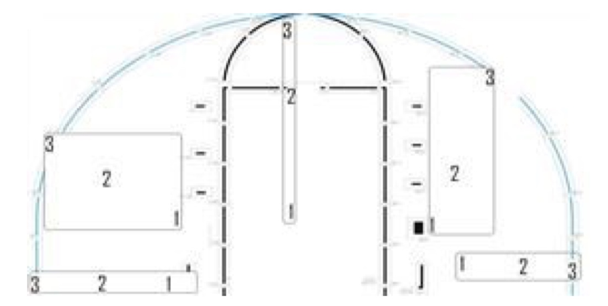

# Drills for shooting

## SHOOTING - 1-2-3 FIVE BLOCK CIRCUIT

- This drill will be shot in five different blocks. Once you are done with one block, you go to the next one without taking any breaks.     
- Pick any block and start at point 1. Shoot a regular set shot. Keep shooting until you make three in a row.
- You then go to point 2 and shoot pull-up jump shots. Don't stop until you make three in a row.
- You then go to point 3 and shoot regular 3-point shots. Don't stop until you make three in a row.
- Once you have completed a block, you move to the next block.
- Finish all 5 blocks.
- 
