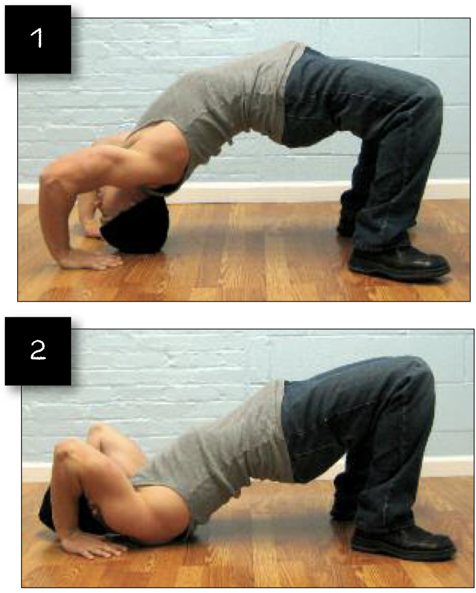

# Wrestler's Bridges Preliminary Version

## Performance

- Lie on your back with the soles of your feet on the floor, and your palms on either side of your head with the fingers pointing towards the feet. Now push the body off the floor until your hips are high and your trunk and limbs form an arch. No part of your body save your feet and hands should be in contact with the floor. This position is called a bridge hold.
- Keeping your trunk and legs braced, lower yourself slowly by bending your elbows, until the crown of your head makes contact with the floor. It will help to rest your head on a towel or slim pillow. This is the start position (image 1).
- Keeping your palms and skull in contact with the floor, slowly bend your head forwards. This will lower your upper body slightly. At no point should your head come away from the floor. When your neck and upper shoulders rest on the floor, stop descending. This is the finish position (image 2).
- Slowly and smoothly press back up to the start position using the combined power of your arms and neck. Pause for a moment, and repeat.

## Goals

| | |
|---|---|
|Progression: | 2x20 |

## Figures

