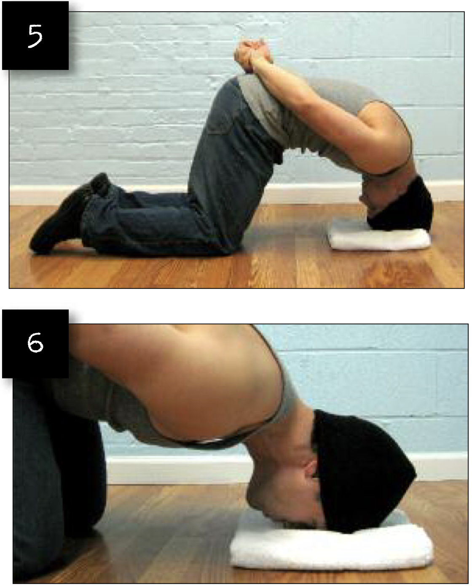
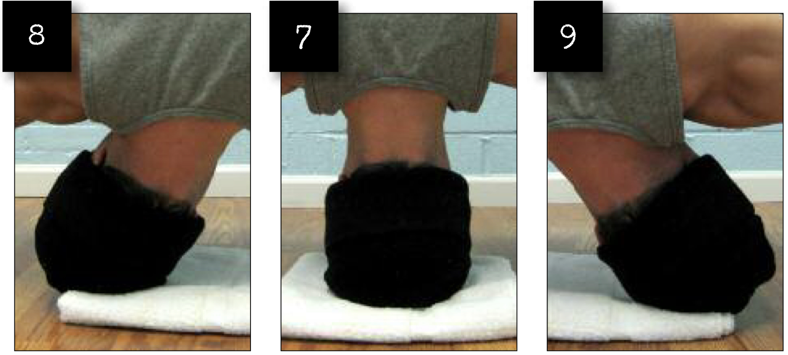

# Front Bridges Preliminary Version

## Performance

- Kneel on the floor with your knees wide apart.
- Straighten up, then bend over forwards. Place the palms on the ground, and lower the crown of your head between them. Rest your head on a towel or slim pillow to cushion your head.
- Take the pressure off your hands until the force of your weight is going through your knees, shins and feet, as well as the crown of your head. Place your hands behind your back to keep them out of the exercise. This is the neutral position (image 5).
- Under full control, allow your head to pivot back until your nose gently makes contact with the floor (image 6).
- Return to the neutral position (image 7) using the power of your frontal neck muscles, then allow your head to pivot to the right (image 8).
- Return to the neutral position (image 7) using the power of your lateral neck muscles, then allow your head to pivot to the left (image 9).
- Return to the neutral position (image 7) using the power of your lateral neck muscles. You have just completed one full repetition. Return to step IV, and repeat.

## Goals

| | |
|---|---|
|Progression: | 2x20 |

## Figures

