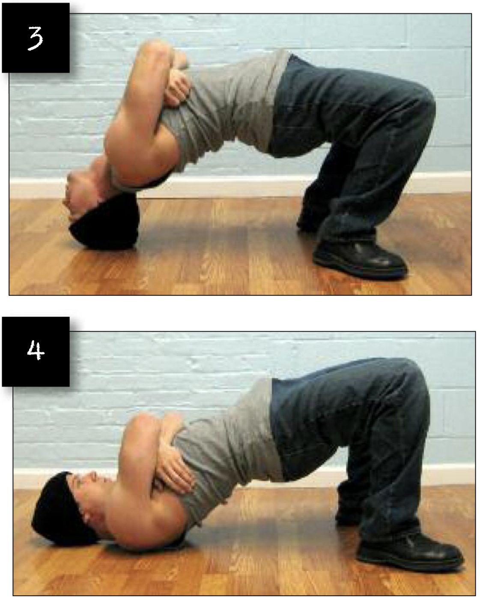

# Wrestler's Bridges Full Version

## Performance

- Lie on your back with the soles of your feet on the floor, and your palms on either side of your head with the fingers pointing towards the feet. Now push the body off the floor until your hips are high and your trunk and limbs form an arch. No part of your body save your feet and hands should be in contact with the floor. This position is called a bridge hold.
- Keeping your trunk and legs braced, lower yourself slowly by bending your elbows, until the crown of your head makes contact with the floor. Using a towel or slim pillow will help cushion your head. Gradually take the pressure off your palms, until only the crown of your head and your feet are supporting the body. Cross the arms upon your chest or rest the palms on the stomach. This is the start position (image 3).
- Slowly bend your head forwards. This will cause your torso to descend slightly. When your neck and upper shoulders rest on the floor, stop descending. This is the finish position (image 4).
- Slowly and smoothly press back up to the start using power of your neck muscles alone. Pause for a moment, and repeat.

## Goals

| | |
|---|---|
|Progression: | 2x20 |

## Figures

