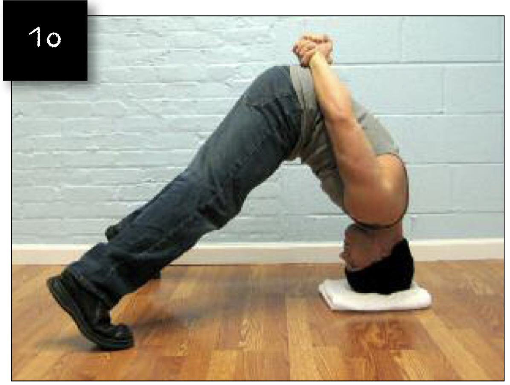
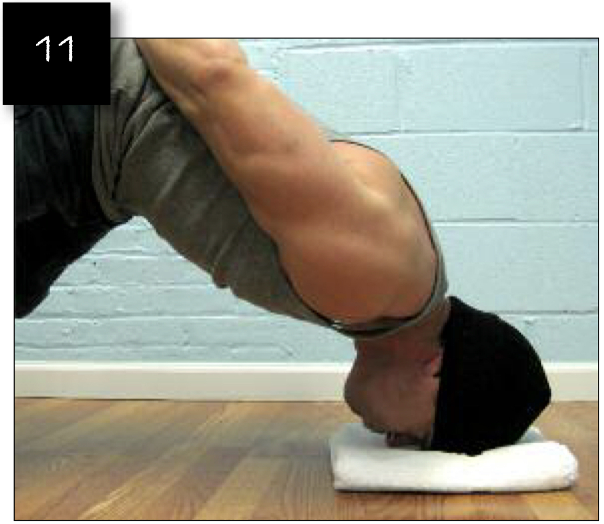
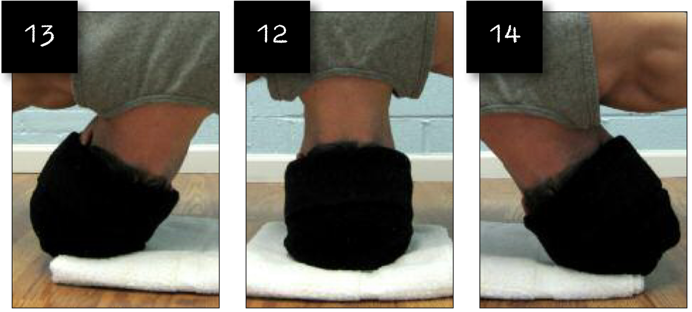

# Front Bridges Full Version

## Performance

- Get into a wide stance. The feet should more than shoulder width apart.
- Bend forwards at the hips, keeping the legs straight or nearly so. Place the palms on the ground, and lower the crown of your head between them. Rest your head on a towel or slim pillow to cushion your head.
- Take the pressure off your hands until the force of your weight is going through both feet and the crown of your head. Place your hands behind your back to keep them out of the exercise. This is the neutral position (image 10).
- Under full control, allow your head to pivot back until your nose gently makes contact with the floor (image 11).
- Return to the neutral position (image 12) using the power of your frontal neck muscles, then allow your head to pivot to the right (image 13).
- Return to the neutral position (image 12) using the power of your lateral neck muscles, then allow your head to pivot to the left (image 14).
- Return to the neutral position (image 12) using the power of your lateral neck muscles. You have just completed one full repetition. Return to step IV, and repeat.

## Goals

| | |
|---|---|
|Progression: | 2x20 |

## Figures

