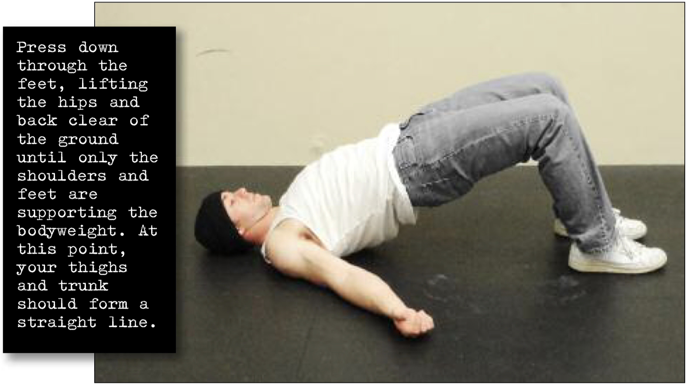

# Short Bridge Hold

## Performance

Lie on your back, with your feet flat on the floor and around 6-8 inches from your butt. This is the start position. Press down through the feet, lifting the hips and back clear of the ground until only the shoulders and feet are supporting the bodyweight. At this point, your thighs and trunk should form a straight line. This is the hold position (see photo) Keep this position for the desired time, breathing as smoothly as possible. Return to the start position by slowly reversing the motion.

## Goals

| | |
|---|---|
|Progression: | 2x10s |

## Figures

