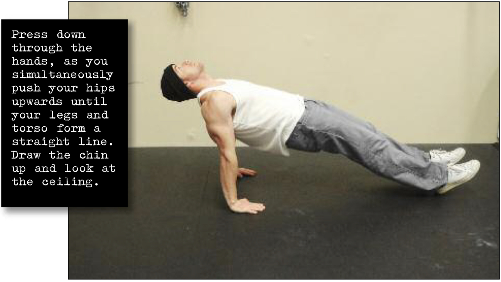

# Straight Bridge Hold

## Performance

Sit up straight on the ground with your legs stretched out in front of you, feet shoulder width apart. Place your palms on the floor on either side of your hips. Press down through the hands, as you simultaneously push your hips upwards until your legs and torso form a straight line. Draw the chin up and look at the ceiling. This is the hold position (see photo). Keep this position for the desired time, breathing as smoothly as possible. Return to the start position by slowly reversing the motion.

## Goals

| | |
|---|---|
|Progression: | 2x10s |

## Figures

