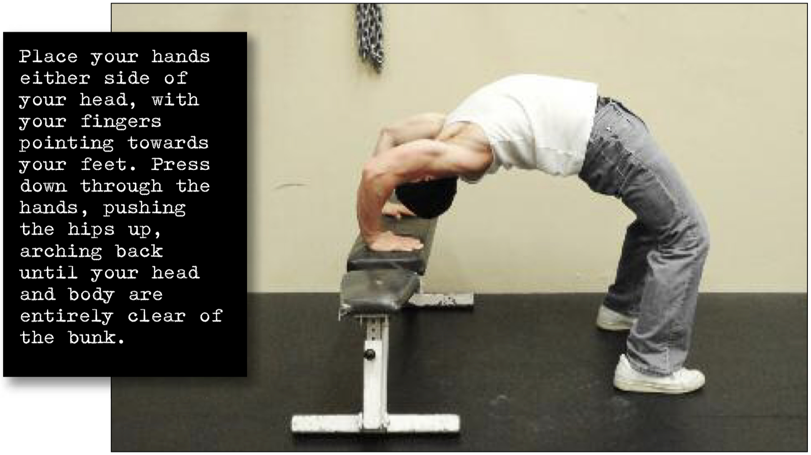

# Angled Bridge Hold

## Performance

Angled bridges require an object which is about the height of a prison bunk. Lie back on the edge of the bunk or bed with your hips clear, and your feet flat on the ground and shoulder width apart. Place your hands either side of your head, with your fingers pointing towards your feet. Press down through the hands, pushing the hips up, arching back until your head and body are entirely clear of the bunk. Look at the wall behind you. This is the hold position (see photo). Keep this position for the desired time, breathing as smoothly as possible. Return to the bunk by slowly reversing the motion.

## Goals

| | |
|---|---|
|Progression: | 2x10s |

## Figures

