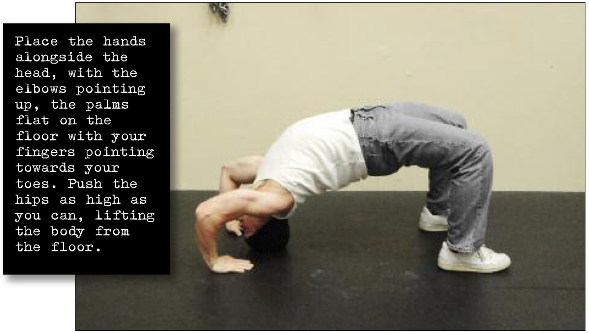

# Head Bridge Hold

## Performance

Lie on your back, with your feet shoulder width apart, flat on the floor and around 6-8 inches from your butt. Place the hands alongside the head, with the elbows pointing up, the palms flat on the floor with your fingers pointing towards your toes. Push the hips as high as you can, lifting the body from the floor. Keep your head in contact with the ground as you go, pivoting it back until the crown of your head is touching the floor. Remember to push up using your arms—the neck is just along for the ride. This is the hold position (see photo). Breathing smoothly during the hold. Lower yourself gently.

## Goals

| | |
|---|---|
|Progression: | 2x10s |

## Figures

