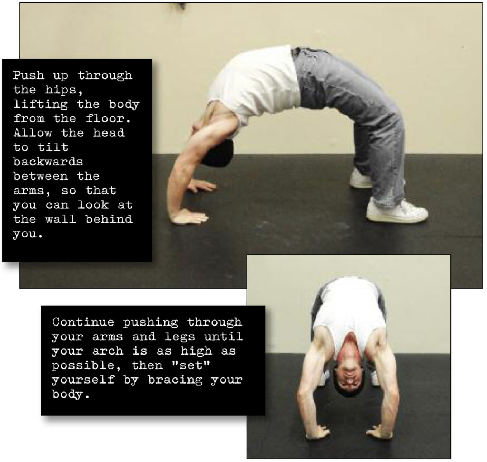

# Bridge Hold

## Performance

Lie on your back, with your feet shoulder width apart, flat on the floor and around 6-8 inches from your butt. Place the hands alongside the head, with the elbows pointing up, the palms flat on the floor with your fingers pointing towards your toes. Push up through the hips, lifting the body from the floor. Allow the head to tilt backwards between the arms, so that you can look at the wall behind you. Continue pushing through your arms and legs until your arch is as high as possible, then “set” yourself by bracing your body. This is the hold position (see photos). Keep this position for the desired time, breathing as smoothly as possible. Get down by slowly reversing the motion.

## Goals

| | |
|---|---|
|Progression: | 2x10s |

## Figures

