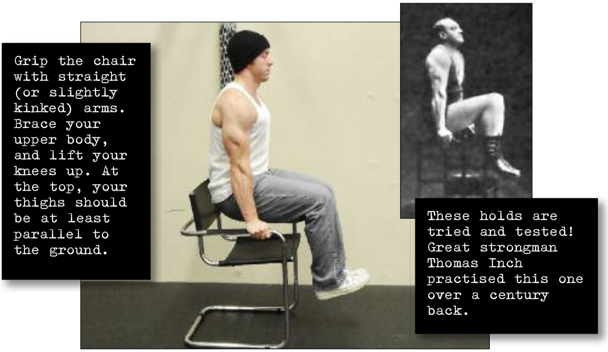

# Bent Leg Hold

## Performance

For this hold, you’ll need to find a sturdy chair with some arms. (If you are in a gym, you can use parallel bars.) Grip the chair with straight (or slightly kinked) arms. Brace your upper body, and lift your knees up. At the top, your thighs should be at least parallel to the ground (see photo). Over time, as this hold gets easy, try to lift your knees higher for a better active stretch. Eventually you’ll be able to pull your knees close to your chest (a tuck hold). Keep your feet and legs together and try to breathe normally during the hold.

## Goals

| | |
|---|---|
|Progression: | 2x10s |

## Figures

