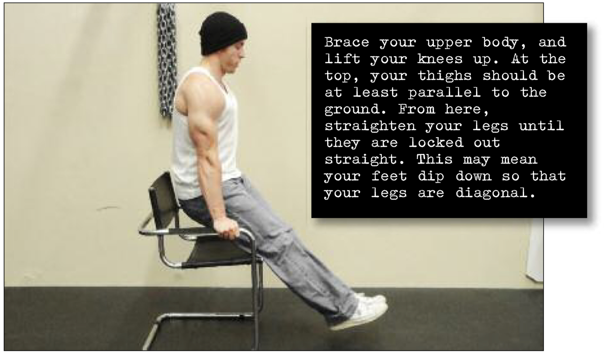

# Straight Leg Hold

## Performance

For this hold, you’ll need the same chair or base you used for the previous technique. Grip the chair with straight (or slightly kinked) arms. Brace your upper body, and lift your knees up. At the top, your thighs should be at least parallel to the ground (this is a bent leg hold). From here, straighten your legs until they are locked out straight. This may mean your feet dip down so that your legs are diagonal (see photo). That’s fine—just make sure those legs are locked out. Keep your feet and legs together and breathe normally.

## Goals

| | |
|---|---|
|Progression: | 2x10s |

## Figures

