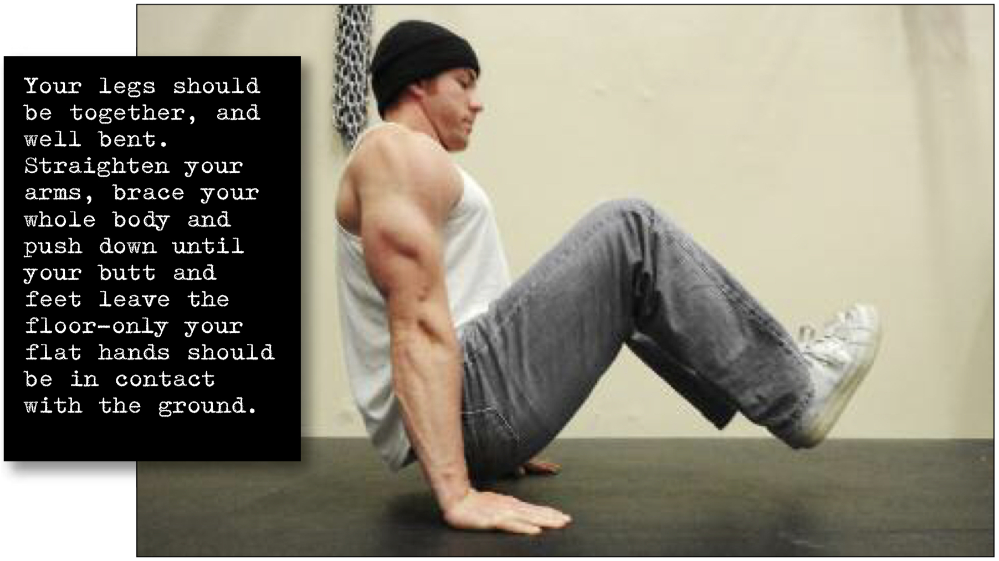

# N Hold

## Performance

There are various names for this technique, but in jail I usually heard it called an N-hold. (In the L-hold your body forms an “L” shape; in this hold it makes like a backwards “N”). Get down on the floor, with your hands by your hips. Your legs should be together, and well bent. Straighten your arms, brace your whole body and push down until your butt and feet leave the floor—only your flat hands should be in contact with the ground (see photo). If this is too difficult at first, make it easier by placing a couple of books under each palm. When this is easy, try the fists, then the palms again.

## Goals

| | |
|---|---|
|Progression: | 2x10s |

## Figures

