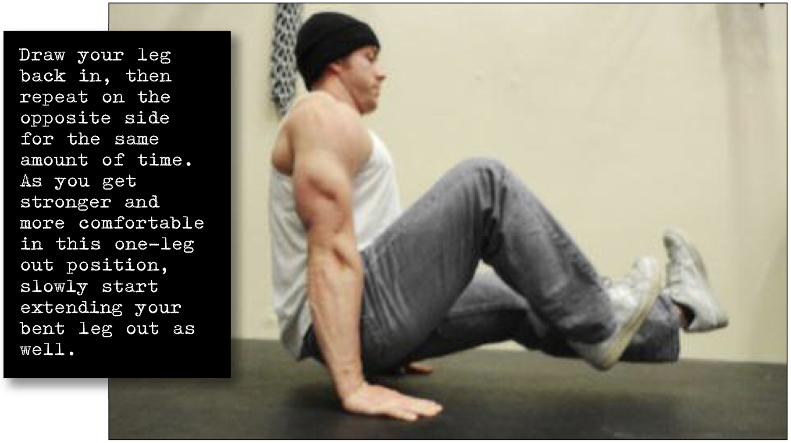

# Uneven N Hold

## Performance

Get down on the floor and perform an N-hold (see previous page). Once in the hold, straighten out one leg as far as you can—ultimately, you want to be able to lock your leg right out, while the other leg stays bent. At no point should your lower body touch the floor (see photo). Draw your leg back in, then repeat on the opposite side for the same amount of time. As you get stronger and more comfortable in this one-leg out position, slowly start extending your bent leg out as well; it’s this kind of transitional experimentation which will lead you to a full L-hold.

## Goals

| | |
|---|---|
|Progression: | 2x10s |

## Figures

