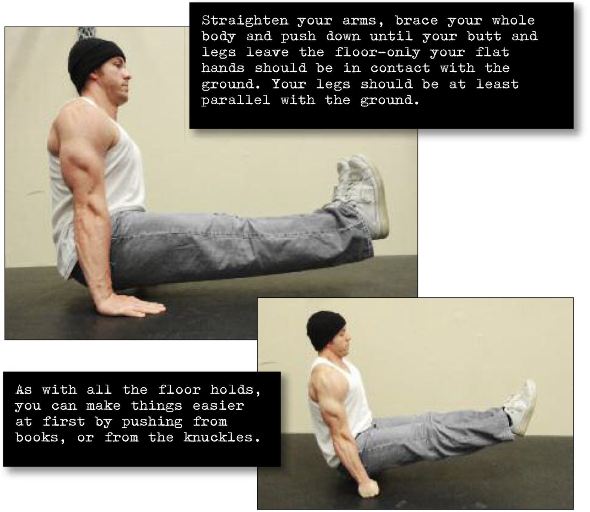

# L Hold

## Performance

Get down on the floor, with your hands by your hips. Your legs should be together and locked out straight, with the toes pointing upwards. Straighten your arms, brace your whole body and push down until your butt and legs leave the floor—only your flat hands should be in contact with the ground. Your legs should be at least parallel with the ground (see photo). As with all the floor holds, you can make things easier at first by pushing from books, or from the knuckles (see inset). If the L-hold becomes too easy, increase the stretch by slowly raising the locked legs (called a V-hold). Breathe normally during the hold, and keep the gut in tight (this is true for all leg raise holds).

## Goals

| | |
|---|---|
|Progression: | 2x10s |

## Figures

