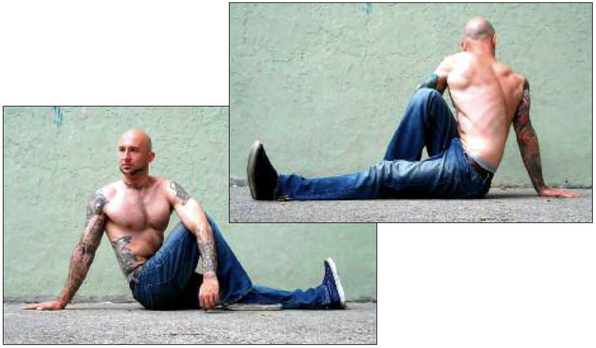

# Straight Leg Twist Hold

## Performance

Sit on the floor with your legs together and outstretched. Bend one leg until your foot is inside the knee of your straight leg. Keep the foot of your bent leg flat on the floor. Twist your opposite shoulder towards your bent knee, and secure the elbow on the outside of that knee. Allow the neck and head to naturally follow the turn of the torso. Place the palm of your other hand behind you, and prop yourself securely on that outstretched arm (see photo). Hold the posture for the required time, trying to breathe as normally as possible. Repeat the hold on the opposite side for the same amount of time.

## Goals

| | |
|---|---|
|Progression: | 2x10s |

## Figures

