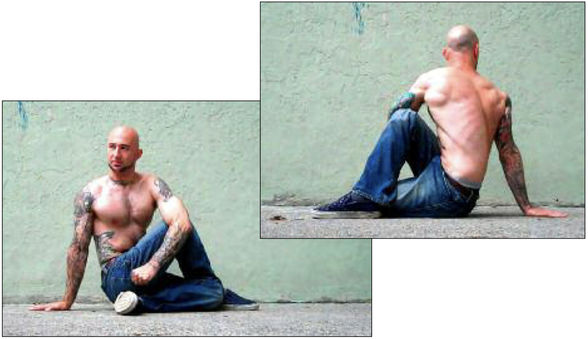

# Easy Twist Hold

## Performance

Sit on the floor with your legs outstretched. Bend one leg and place the foot flat on the floor, to the outside of your opposite knee. Bend the other leg until your heel comes in contact with your glutes, keeping that leg on the floor. Twist your opposite shoulder towards your raised knee, and secure the elbow on the outside of that knee. Place the palm of your other hand behind you, and prop yourself securely on your outstretched arm. Allow your neck to naturally continue the twist, and look obliquely back (see photos). Hold the posture for the required period, trying to breathe as normally as possible. Repeat the hold on the opposite side for the same amount of time.

## Goals

| | |
|---|---|
|Progression: | 2x10s |

## Figures

