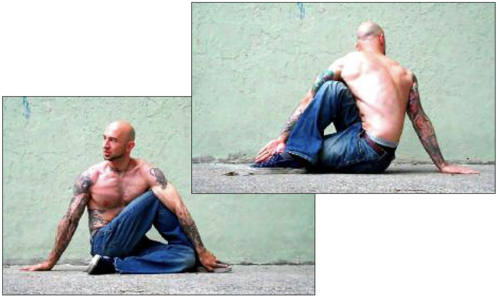

# Half Twist Hold

## Performance

Sit on the floor with your legs outstretched. Bend one leg and place the foot flat on the floor, to the outside of your opposite knee. Bend the other leg until your heel comes in contact with your glutes, keeping that leg on the floor. Twist your opposite shoulder towards your raised knee, and slide your hand down your outer calf, so that it runs parallel to your shin until the fingers touch your instep. Place the palm of your other hand behind you, and prop yourself securely on your outstretched arm. Rotate your neck to look behind you (see main photo). Hold the posture for the required time, trying to breathe as normally as possible. Repeat the hold on the opposite side.

## Goals

| | |
|---|---|
|Progression: | 2x10s |

## Figures

