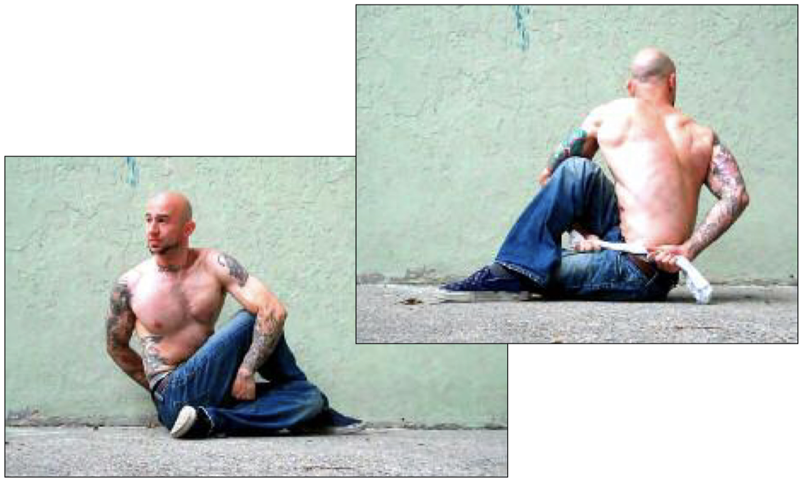

# 3/4 Twist Hold

## Performance

For this exercise you need an object—anything about a foot long (a hand towel is a perfect option). Sit on the floor with your legs outstretched. Now perform the half twist hold (see page 216). The hand of the arm alongside the shin should be holding the towel.  Once alongside your shin, push the hand holding the towel back and under the elbow. Reach around your body with the other hand, and try to grab hold of the towel. This may take some practice at first. Once you grab the towel, rotate your neck to look behind you (see photos). Hold the posture for the required time, trying to breathe as normally as possible. Repeat the hold on the opposite side.

## Goals

| | |
|---|---|
|Progression: | 2x10s |

## Figures

