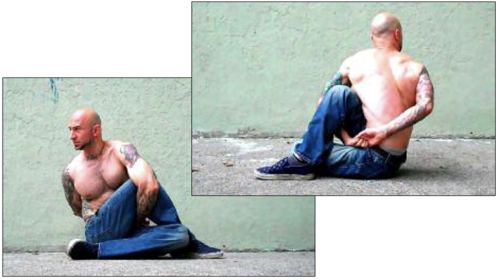

# Full Twist Hold

## Performance

Sit on the floor with your legs outstretched. Bend one leg and place the foot flat on the floor, to the outside of your opposite knee. Bend the other leg until your heel comes in contact with your glutes, keeping that leg on the floor. Twist your opposite shoulder towards your raised knee, and push the hand of that shoulder holding back and under the elbow. Reach around your body with the other hand, and touch fingers. Hook the fingers, or lock them in a “monkey grip” (see top photo). Lift your chest, and rotate your neck to look behind you (see bottom photo). Hold the posture for the required time, trying to breathe as normally as possible. Repeat the hold on the opposite side.

## Goals

| | |
|---|---|
|Progression: | 2x10s |

## Figures

