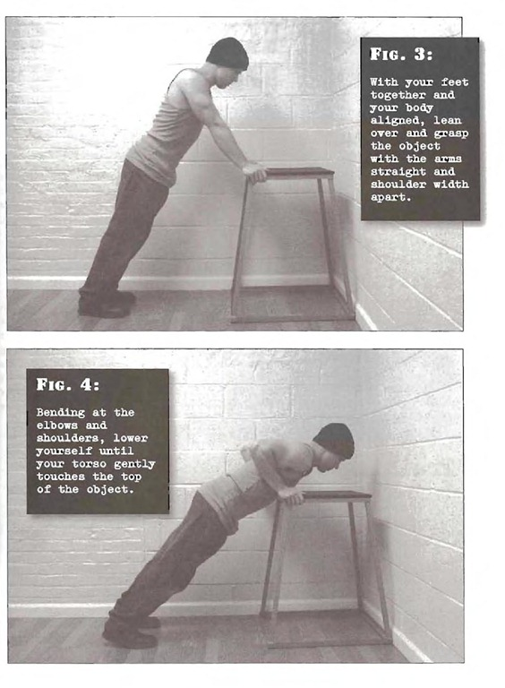

# Incline Pushups

## Performance

- Find a secure object or piece of furniture which is about half your height
- With your feet together and your body aligned, lean over and grasp the object with the arms straight and shoulder width apart. The start position should put you at about 45 degrees from the floor
- Bending at the elbows and shoulders, lower yourself until your torso gently touches the top of the object
- Pause briefly before pressing back up to the start position, and repeat

## Goals

| | |
|---|---|
|Beginner: | 1x10 |
|Intermediate: | 2x20 |
|Progression: | 3x40 |

## Figures

