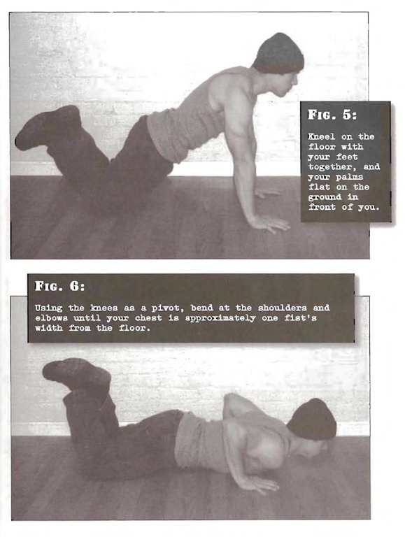

# Kneeling Pushups

## Performance

- Kneel on the floor with your feet together, and your palms flat on the ground in front of you. The arms should be straight, shoulder width apart, and in line with your chest. Link one ankle around the other, and keep the hips straight and in alignment with the trunk and head.
- Using the knees as a pivot, bend at the shoulders and elbows until your chest is approximately one fist's width from the floor.
- Pause and press back to the start position, then repeat.

## Goals

| | |
|---|---|
|Beginner: | 1x10 |
|Intermediate: | 2x15 |
|Progression: | 3x30 |

## Figures

