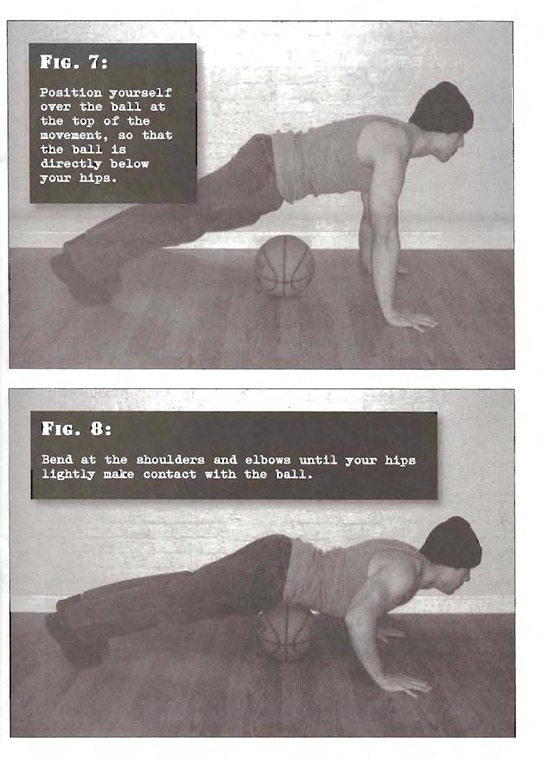

# Half Pushups

## Performance

- From the kneeling position, place your palms on the floor and stretch your legs out behind you. Your hands should be shoulder width apart, and directly below your upper chest. Your feet and legs should be kept together. Tighten your supporting muscles, so that your back, hips and legs stay locked in line.
- Starting with the arms straight, lower yourself approximately half the length of your extended arms, or until your elbows form a right angle. An excellent way to establish how far to descend is to use a standard basketball or soccer ball. Position yourself over the ball at the top of the movement, so that the ball is directly below your hips.
- Bend at the shoulders and elbows until your hips lightly make contact with the ball. On most people, this will be a good, objective indicator of the correct bottom position.
- Pause before pressing forcefully back to the start position.

## Goals

| | |
|---|---|
|Beginner: | 1x8 |
|Intermediate: | 2x12 |
|Progression: | 2x25 |

## Figures

