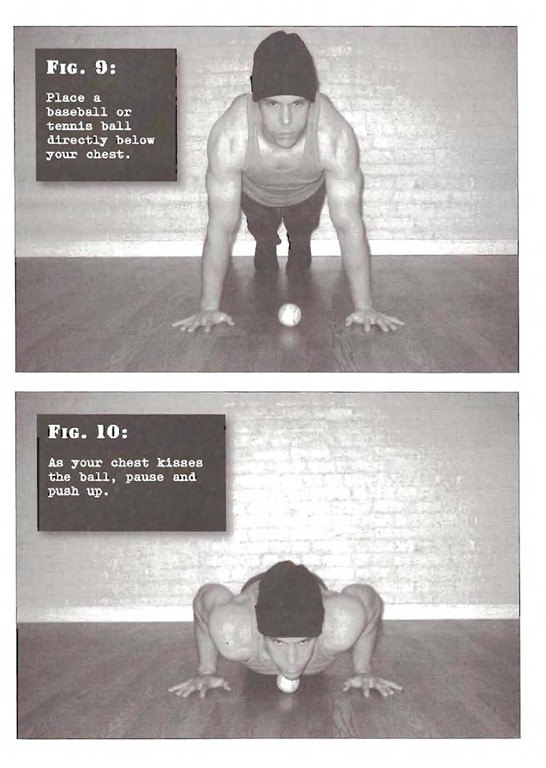

# Full Pushups

## Performance

- From the kneeling position, place your palms on the floor and stretch your legs out behind you. Keep your thighs and feet together, and ensure that the hands are below your upper chest and shoulder width apart. Straighten the arms. The hips and spine should be in line.
- Bend at the elbows and shoulders until your breastbone comes to within a fist's width from the floor. If you're training alone and you wish to keep to the right depth, place a baseball or tennis ball directly below your chest.
- As your chest kisses the ball, pause and push up. 

## Goals

| | |
|---|---|
|Beginner: | 1x5 |
|Intermediate: | 2x10 |
|Progression: | 2x20 |

## Figures

