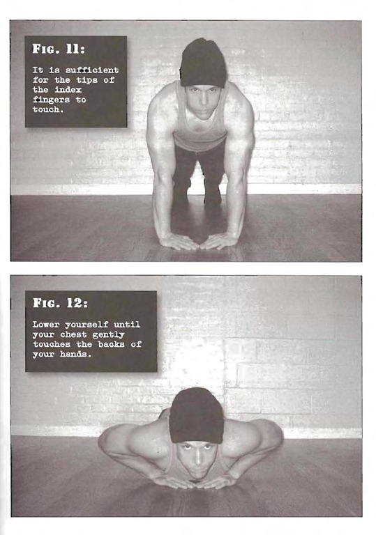

# Close Pushups

## Performance

- Begin this technique in the same top position as full pushups (Step 5), but with the hands touching. You don't need to overlap the hands or form a "diamond" between the thumbs and index fingers; it is sufficient for the tips of the index fingers to touch.
- From the straight arm start position, lower yourself until your chest gently touches the backs of your hands.
- Pause briefly before pressing back to the start position. 

## Goals

| | |
|---|---|
|Beginner: | 1x5 |
|Intermediate: | 2x10 |
|Progression: | 2x20 |

## Figures

