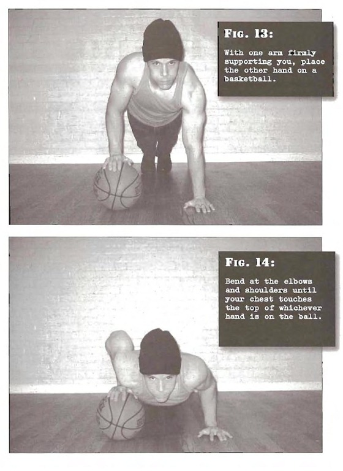

# Uneven Pushups

## Performance

- Get into the classic pushup position; feet together, legs, hips and back aligned, and arms straight with the palms on the floor beneath your upper chest. With one arm firmly supporting you, place the other hand on a basketball. Both your hands should be directly below your shoulders for stability. This is the start position
- Once you have found your balance, do your best to evenly distribute your weight through both hands. At first this will not be easy, but persevere. Bend at the elbows and shoulders until your chest touches the top of whichever hand is on the ball
- Pause briefly before pressing back up to the start position

## Goals

| | |
|---|---|
|Beginner: | 1x5 (both sides) |
|Intermediate: | 2x10 (both sides) |
|Progression: | 2x20 (both sides) |

## Figures

