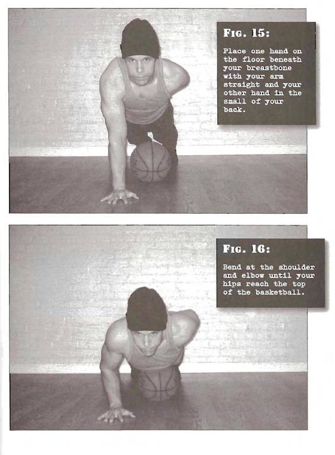

# 1/2 One-arm Pushups

## Performance

- Get into the half pushup top position, with a basketball located below your hips, as described in Step 4.
- Place one on the floor beneath your breastbone with your arm straight and your other hand in the small of your back. This is the start position (fig. 15).
- Bend at the shoulder and elbow until your hips reach the top of the basketball. This is the finish position (fig.16).
- Pause and press back to the start position.
- If your triceps is weak, you'll have a tendency to twist your torso as you move. Don't--the whole body should be kept straight. This is true for all pushups. 

## Goals

| | |
|---|---|
|Beginner: | 1x5 (both sides) |
|Intermediate: | 2x10 (both sides) |
|Progression: | 2x20 (both sides) |

## Figures

