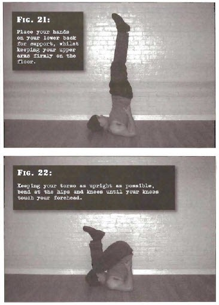

# Shoulderstand Squats

## Performance

- Lie on your back with knees well bent, kick against the floor while pushing with your hands until feet are up in the air, place hands on your lower back for support
- Body should be locked straight, not bent at the hips. Constantly support your weight and keep any pressure off the neck
- Bend at the hips and knees until knees touch your forehead, keep your torso as upright as possible
- Extend your legs directly back up, until back in the start position. Repeat

## Goals

| | |
|---|---|
|Beginner: | 1x10 |
|Intermediate: | 2x25 |
|Progression: | 3x50 |

## Figures

