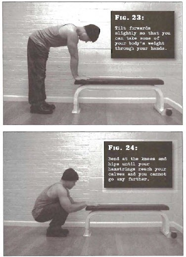

# Jackknife Squats

## Performance

- Stand in front of a sturdy object which comes up to your knees, or at least the tops of your shins
- Your legs should be shoulder width apart, or a little wider
- Keeping your legs fairly staight, bend at your hips until your palms are in contact with the object. Tilt forwards slightly so that you can take some of your body's weight through your hands
- With your torso remaining as parallel to the floor as possible, bend at the knees and hips until your hamstrings reach your calves and you cannot go any further. This will require that you bend your arms, also
- Using combined leg and arm power, push yourself up to the start position. Do not raise the heels at any point during the exercise

## Goals

| | |
|---|---|
|Beginner: | 1x10 |
|Intermediate: | 2x20 |
|Progression: | 3x40 |

## Figures

