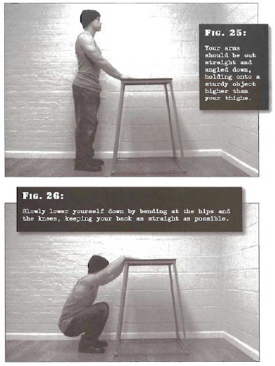

# Supported Squats

## Performance

- Stand up straight with the feet shoulder width apart, or slightly wider. Your arms should be out straight and angled down, holding onto a sturdy object higher than your thighs. A desk, robust basin or the back of a chair will do.
- Slowly lower yourself down by bending at the hips and the knees, keeping your back as straight as possible, until your hamstrings meet your calves and you cannot descend any further.
- Pause for a moment, before pushing yourself up using mostly leg power. To take some of the pressure off your legs -- particularly in the bottom position -- pull yourself up slightly with your arms, by exerting downward force on the object you are holding.
- Try to keep the arms faily straight. Your heels should remain flat on the floor throughout the exercise.

## Goals

| | |
|---|---|
|Beginner: | 1x10 |
|Intermediate: | 2x15 |
|Progression: | 3x35 |

## Figures

