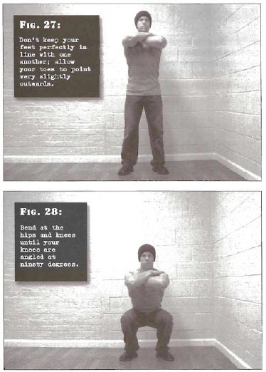

# Half Squats

## Performance

- Stand with the feet shoulder width apart, or slightly wider. Don't keep your feet perfectly in line with one another; allow your toes to point very slightly outwards. Place your hands in a comfortable position-on your hips, chest or shoulders is fine.
- Now bend at the hips and knees until your knees are angled at ninety degrees, or (in other words) your thighs are parallel to the floor.
- You can use a mirror or ask a friend the first few times until your body learns the right depth. Don't rush the technique, and never bounce; pause in mid-air at the bottom position for a one count before returning to the start position under full muscular control.
- Keep the back straight throughout the motion, and keep your heels flat on the floor. Your knees should always point in the same direction as your feet; don't ever allow the knees to "track" inwards as you squat. The outwards angle of your toes will assist you with this. 

## Goals

| | |
|---|---|
|Beginner: | 1x8 |
|Intermediate: | 2x35 |
|Progression: | 2x50 |

## Figures

