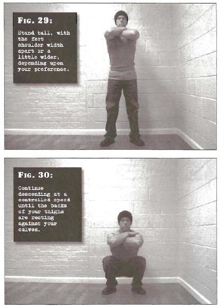

# Full Squats

## Performance

- Stand tall, with the feet shoulder width apart or a little wider, depending upon your preference. Turn the toes slightly out, and place the arms in a comfortable position.
- Bend at the hips and knees, keeping the back straight. When your thighs reach approximately parallel to the floor, shift your weight backwards as if you were about to sit down. Continue descending at a controlled speed until the backs of your thighs are resting against your calves.
- Pause for a moment before pressing yourself back up with leg strength alone. Your upward motion should be the reverse of your downward motion. Don't raise the heels, or allow the knees to track inwards. 

## Goals

| | |
|---|---|
|Beginner: | 1x5 |
|Intermediate: | 2x10 |
|Progression: | 2x30 |

## Figures

