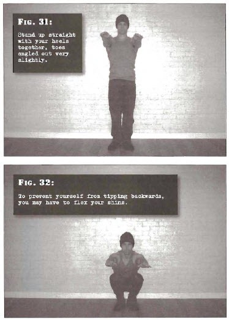

# Close Squats

## Performance

- Stand up straight with your heels together, toes angled out very slightly. Your arms should be straight out in front of your chest. 
- Bend at the knees and hips until your hamstrings are resting on your calves and you can go no further. Your chest will be pressed into your thighs. Do not raise the heels. To prevent yourself from tipping back-wards, you may have to flex your shins to pull your toes up so that you ease forwards.
- Return to the start position using leg power only.

## Goals

| | |
|---|---|
|Beginner: | 1x5 |
|Intermediate: | 2x10 |
|Progression: | 2x20 |

## Figures

