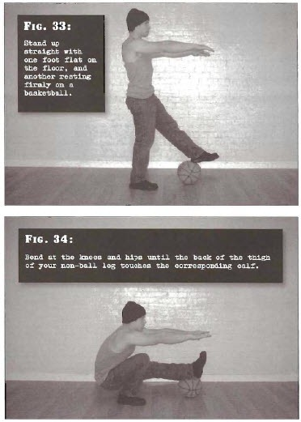

# Uneven Squats

## Performance

- Stand up straight with one foot flat on the floor, and another resting firmly on a basketball located approximately one foot length in front of the other foot. The feet should be shoulder width apart or a little wider. Your arms should be out in front of you, directly opposite your chest.
- Bend at the knees and hips until the back of the thigh of your non-ball leg touches the corresponding calf. You will not be able to descend any further, despite the fact that your ball leg is not compressed as much.
- While learning this position, you may tip backwards, so ensure that you have enough clear space behind you just in case. This applies to all deep squatting.
- Pause briefly, before pushing yourself back up to the start position with both legs. At no point during the exercise should you raise your heel, rock forwards or bounce, despite the fact that you may instinctively want to do these things at first. Use strength. 

## Goals

| | |
|---|---|
|Beginner: | 1x5 (both sides) |
|Intermediate: | 2x10 (both sides) |
|Progression: | 2x20 (both sides) |

## Figures

