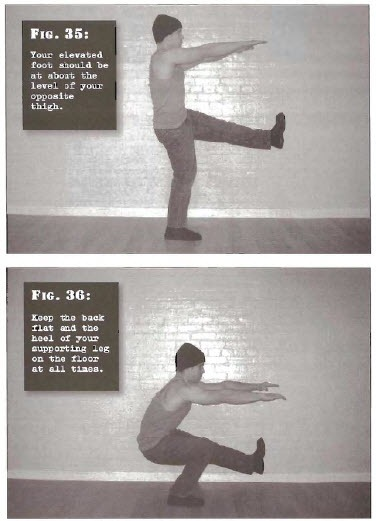

# 1/2 One-Leg Squats

## Performance

- Stand straight, with one foot flat on the floor, and the other foot up in the air in front of you. Your elevated foot should be at about the level of your opposite thigh, and the leg should be straight, or nearly so. Place your hands out in front of your chest.
- Bend the hip and knee of the leg which is supporting your bodyweight, until the knee is bent about ninety degrees. This will put your thigh approximately parallel with the floor. At this point, your raised foot should still be some way off the ground.
- Pause for a moment under tension, before driving yourself up using the power of your single leg. Keep the back flat and the heel of your supporting leg on the floor at all times. 

## Goals

| | |
|---|---|
|Beginner: | 1x5 (both sides) |
|Intermediate: | 2x10 (both sides) |
|Progression: | 2x20 (both sides) |

## Figures

