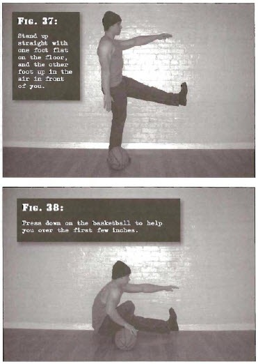

# Assisted One-Leg Squats

## Performance

- Place a basketball to the side of the foot of the leg you are planning to work. Stand up straight with one foot flat on the floor, and the other foot up in the air in front of you, as for half one-leg squats (Step 8). Place the arm corresponding to your raised leg out in front of you, and let your other arm hang by your side
- Bend at the hip and knee of your supporting leg until your hamstrings meet your calf, and you cannot go any further. Place your hand firmly on the basketball. This is the finish position
- Return to the standing position using mostly leg strength, but press down on the basketball to help you over the first few inches. Keep the heels flat

## Goals

| | |
|---|---|
|Beginner: | 1x5 (both sides) |
|Intermediate: | 2x10 (both sides) |
|Progression: | 2x20 (both sides) |

## Figures

