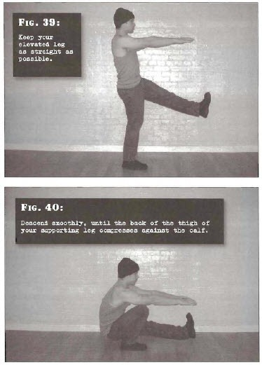

# One-Leg Squats

## Performance

- Stand tall. Raise one foot in the air, until it is approximately level with your hips. Keep your elevated leg as straight as possible. This will not be too difficult provided you have spent time mastering the previous steps. Place the arms directly out in front of your chest.
- Bend at the knee and hip of the supporting leg. Control your descent; do not allow yourself to just drop. Descend smoothly, until the back of the thigh of your supporting leg compresses against the calf and you cannot go any further. Your torso will also be tight against your working thigh.
- Pause for a count of one, under tension. Push yourself back up to the start position using leg strength alone. There should be no momentum at all. Retain a straight back, hold the elevated foot off the ground, and keep the heels firmly on the floor. Pause at the top, and repeat.

## Goals

| | |
|---|---|
|Beginner: | 1x5 (both sides) |
|Intermediate: | 2x10 (both sides) |
|Elite: | 2x50 (both sides) |

## Figures

