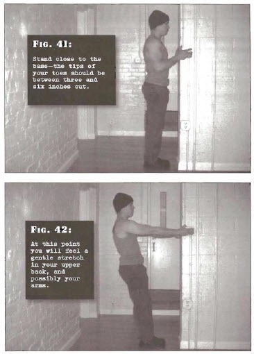

# Vertical Pulls

## Performance

- Stand close to a vertical base, the tips of your toes should be between three and six inches out, ideally your hands should be shoulder width but any symmetrical position will suffice, your arms will be well bent because of proximity to the base
- Allow your bodyweight to shift back slightly, extend your arms as you go, until they are very nearly straight and your body is angled diagonally backwards, you will feel a gentle stretch in your upper back
- Pause momentarily before pulling yourself back to the start position, by contracting the shoulder blades and bending the arms simultaneously. Pause and repeat

## Goals

| | |
|---|---|
|Beginner: | 1x10 |
|Intermediate: | 2x20 |
|Progression: | 3x40 |

## Figures

