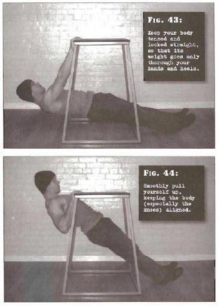

# Horizontal Pulls

## Performance

- Find a horizontal base you can hold onto which will safely carry your bodyweight. It needs to be at least as high as your hips
- Get down so that your chest and lower body are underneath the table and reach up so that you can hold the lip, using an overhand grip. Ideally your hands should be shoulder width
- Pull yourself up so that your back is off the floor. Depending upon the height of the table, your arms will probably have to be slightly bent for this. Keep your body tensed and locked straight, so that its weight goes only through your hands and heels
- Now smoothly pull yourself up, keeping the body (especially the knees) aligned, until your chest touches the lip of the table at the point where your hands are gripping
- Pause for a count of one, before lowering back to the start position. Repeat

## Goals

| | |
|---|---|
|Beginner: | 1x10 |
|Intermediate: | 2x20 |
|Progression: | 3x30 |

## Figures

