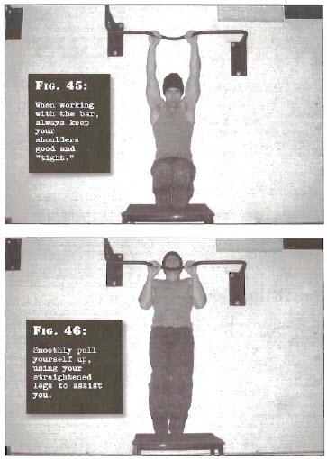

# Jackknife Pulls

## Performance

- To perform this preliminary pullup exercise, you will require a high horizontal bar and a high-backed chair or similar object situated just in front of the bar. Jump up and grab hold of the bar. Your arms should be approximately shoulder width apart, in an overhand grip. When working with the bar, always keep your shoulders good and "tight". Don't fully relax your arms, either; keep them flexed and with a slight kink in the elbows.
- Now swing your legs up and rest your calves near the ankles on the back of the object you've placed in front of the bar. Arrange this object beforehand so that you'll be able to straighten your legs out. Ideally, the object should be high enough that the feet of your straight legs end up opposite your pelvis-the classic jack-knife angle.
- Now smoothly pull yourself up, using your straight-ened legs to assist you by pushing down with them. When your chin passes the bar, you are in the finish position.
- Pause before lowering yourself to the start position under full muscular control.

## Goals

| | |
|---|---|
|Beginner: | 1x10 |
|Intermediate: | 2x15 |
|Progression: | 3x20 |

## Figures

