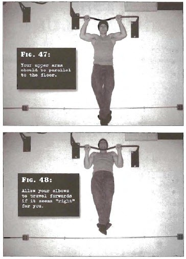

# Half Pullups

## Performance

- Take hold of a horizontal bar. The bar should be high enough that your feet are clear of the f1oor-even if only by an inch-when your body hangs down straight. Use an overhand grip which is shoulder width or a little wider.
- Jump up so that you are supporting your weight on arms that are bent approximately at right angles (your upper arms should be parallel to the floor). Keep your shoulders tight. Bend at the knees, looping one ankle over the other to take the legs out of the movement. This is the start position.
- Smoothly pull yourself up by bending at the shoul-ders and elbows until your chin clears the height of the bar. This is the finish position.Allow your elbows to travel forwards if it seems "right" for you.
- Pause at the top for a moment, before lowering to the start position under control. Repeat as needed. After you get set, keep the legs still throughout the entire motion.

## Goals

| | |
|---|---|
|Beginner: | 1x8 |
|Intermediate: | 2x11 |
|Progression: | 2x15 |

## Figures

