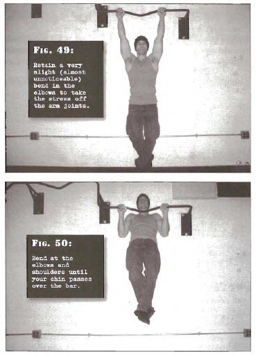

# Full Pullups

## Performance

- Grab hold of a horizontal bar with a shoulder width overhand grip. A slightly wider grip is acceptable-experiment to find out which width feels strongest for you.
- Bend at the knee and loop the ankles behind your body. Your feet should be clear of the ground. Tense the body, keep the shoulders down tight and retain a very slight (almost unnoticeable) bend in the elbows to take the stress off the arm joints and place it on the muscles instead.
- Bend at the elbows and shoulders until your chin passes over the bar.
- Enjoy the view! Pause for a moment, before reversing the motion under full control.
- Don't be explosive-this means depending on momentum during the exercise. The perfect muscle-building technique is smooth. Try to take two seconds up and two seconds down, pausing for a second at the top and bottom.

## Goals

| | |
|---|---|
|Beginner: | 1x5 |
|Intermediate: | 2x8 |
|Progression: | 2x10 |

## Figures

