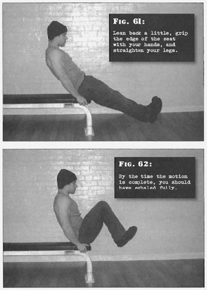

# Knee Tucks

## Performance

- Sit on the edge of a chair or bed. Lean back a little, grip the edge of the seat with hands and straighten legs, your feet should be together with the heels raised a few inches from the floor
- Smoothly bring the knees up and in until they are approximately six to ten inches from your chest. Exhale as you draw the knees in, by the time the motion is complete, you should have exhaled fully and your abs tightly contracted
- Pause for one count before reversing the motion and back to the start position. Inhale as you extend, your feet should follow a straight line backwards and forwards, and should not touch the floor until the set is completed
- Resist the urge to pump out reps quickly, take extra breaths between reps if needed

## Goals

| | |
|---|---|
|Beginner: | 1x10 |
|Intermediate: | 2x25 |
|Progression: | 3x40 |

## Figures

