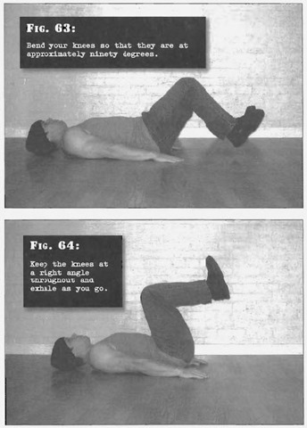

# Flat Knee Raises

## Performance

- Lie flat on the floor, with your legs together and your arms by your side. Bend your knees so that they are at approximately ninety degrees, with the feet an inch or two off the ground. Pressing hard on the floor with your hands will help keep your torso stable
- Now smoothly bring your knees up over your hips, so that your thigns are perpendicular to the floor, and your calves are parallel to the floor. Keep the knees at a right angle throughout and exhales as you go, keeping your stomach muscles tight
- Pausse for a count of one, before reversing the motion by extending your legs as you lower your feet. Inhale as you return to the start position
- After you begin, at no point throughout the movement should your feet touch the floor

## Goals

| | |
|---|---|
|Beginner: | 1x10 |
|Intermediate: | 2x20 |
|Progression: | 3x35 |

## Figures

