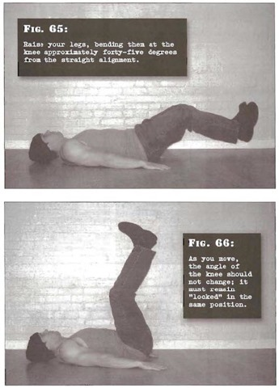

# Flat Bent Leg Raises

## Performance

- Lie on your back with your legs together and stretched out on the floor. Your hands should be by your sides, and also in contact with the floor. Raise your legs, bending them at the knee approximately forty-five degrees from the straight alignment. Your feet should be kept an inch or two off the floor. 
- The positive portion of the exercise involves raising the legs and feet smoothly--over a count of two seconds-until the feet are directly above the pelvis. As you move, the angle of the knee should not change; it must remain "locked" in the same position. Pressing down on the floor with the hands will help you stabilize your torso throughout the movement.
- Pause at the top, before reversing the motion. Pause again in the start position before repeating as necessary.
- Exhale as the feet move up, inhale as they are moving down. Keep the stomach tight at all times. The feet should not touch the floor at all dur-ing the set.

## Goals

| | |
|---|---|
|Beginner: | 1x10 |
|Intermediate: | 2x15 |
|Progression: | 3x30 |

## Figures

