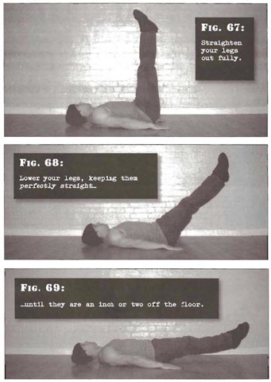

# Flat Frog Leg Raises

## Performance

- Perform the positive portion of Step 3, the bent leg raise, but instead of pausing at the top, straighten your legs out fully. They should be perfectly straight, and perpendicular to the floor, so that your legs and torso form a right angle. You should exhale throughout this two-part motion.
- Lower your legs, keeping them perfectly straight until they are an inch or two off the floor. In most exercises you should take about two seconds to go up and two seconds to go down. But for this exercise count four seconds down, to allow your body more work in the stronger position. Inhale as your legs slowly descend. 
- Bend your knees again until they are fixed at 45 degrees. Repeat. 

## Goals

| | |
|---|---|
|Beginner: | 1x8 |
|Intermediate: | 2x15 |
|Progression: | 3x25 |

## Figures

