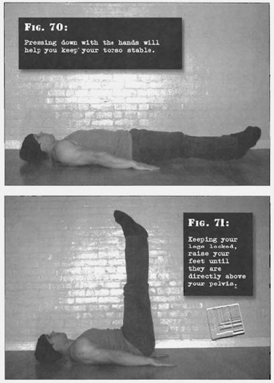

# Flat Straight Leg Raises

## Performance

- Lie on the floor, face up. Your feet should be together, your legs should be straight, and your arms should be by your sides. Lift your feet an inch or two from the floor. Pressing down with the hands will help you keep your torso stable.
- Now, keeping your legs locked, raise your feet until they are directly above your pelvis. Exhale as you lift, keeping the stomach tight. It should take you at least two seconds to smoothly accomplish this - don't explode up. Your legs and torso will form a right angle at this point.
- Pause briefly, before reversing the motion exactly, inhaling as you go down. Pause again in the start position and repeat.
- At no point should allow your knees to unlock, and your heels shouldn't touch the floor until the set is completed.

## Goals

| | |
|---|---|
|Beginner: | 1x5 |
|Intermediate: | 2x10 |
|Progression: | 2x20 |

## Figures

