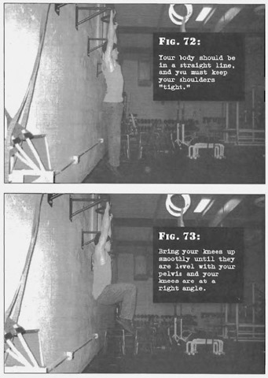

# Hanging Leg Raises

## Performance

- Jump up and grab an overhead bar. Your hands should be about shoulder width apart. The bar needs to be high enough that your feet hang clear from the ground, even if only by an inch. Your body should be in a straight line, and you must keep your shoulders "tight".
- Bring your knees up smoothly until they are level with your pelvis and your knees are at a right angle. Your thighs will be parallel with the floor. Exhale during this motion, keeping your stomach pulled in.
- Pause for a moment, then reverse the motion until your body is fully extended, inhaling as you go. Repeat.

## Goals

| | |
|---|---|
|Beginner: | 1x5 |
|Intermediate: | 2x10 |
|Progression: | 2x15 |

## Figures

