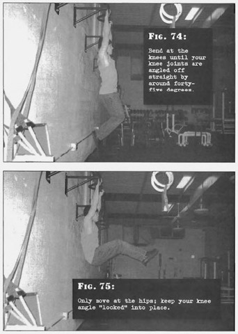

# Hanging Bent Leg Raises

## Performance

- Grab an overhead bar so that your body is in a straight line and your feet are clear of the ground. Your hands should be approximately shoulder width, and your shoulders kept nice and tight. Now bend at the knees until your knee joints are angled off straight by around forty-five degrees. This will put your feet a few inches behind the rest of your hanging body.
- Smoothly raise your legs at the hips until your feet are opposite your pelvis.
- Pause and reverse the motion, before repeating.
- Only move at the hips; keep your knee angle "locked" into place. Exhale as you raise your legs, inhale as you lower them. Keep the abs tense.

## Goals

| | |
|---|---|
|Beginner: | 1x5 |
|Intermediate: | 2x10 |
|Progression: | 2x15 |

## Figures

