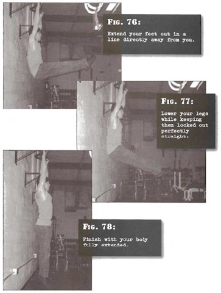

# Hanging Bent Leg Raises

## Performance

- Assume a start position identical to Step 7, hanging bent leg raises, and raise your legs just as you would for that same exercise.
- Once you reach the top position with your feet in line with your hips, extend your feet out in a line directly away from you, so that your legs are perfectly straight. This will put your locked legs level with the floor, and your upper and lower body at a right angle.
- Pause for a moment, but do not reverse the motion. Instead, lower your legs while keeping them locked out perfectly straight.
- Finish with your body fully extended before assuming the start position again and repeating for the desired number of reps. Exhale as the legs are going up, inhale as they are going down, and keep the stomach tucked in at all times.

## Goals

| | |
|---|---|
|Beginner: | 1x5 |
|Intermediate: | 2x10 |
|Progression: | 2x15 |

## Figures

